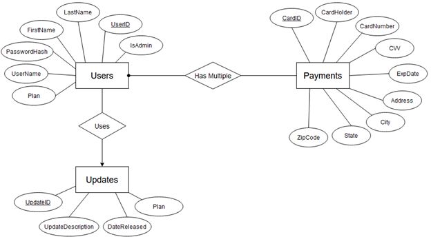

# FakeSaaS-CS317
Many modern applications require a user account and log-in system. I have created a few online applications in the past, but I have never added an account system to any of them. Therefore, I decided to create a user account and log-in system as a learning experience.

My project is called Fake SQL SaaS (Software as a Service). As the name suggests, the actual application itself does not exist; I instead only created a user account system around a fake application. The idea was that I could reuse the code I’ve written (or at least the skills I’ve acquired) in any future online application I create. The program enables the user to first create an account. They can enter in their name and create a username and password. Once the account is created, they can log in to said account and view their profile information. On their account page, the user can modify their user information. They can also add multiple credit/debit cards to their account. They can update the payment types that already exist on their account. They can also view the history of updates for their current plan. A plan is the current version of the application the user is using (free, pro, premium, ultimate, etc.). Finally, they can delete their account from the database. The next part of the program is admin accounts. The two types of users in my program are normal users and admins. Admins have higher permissions than normal users. Admins can perform everything normal users, but they can also view the information on other user accounts. They can also add new updates to the specified plan. Finally, they can delete other user accounts. The backend database is organized into the set of user accounts, the set of payment types associated with user accounts, and the updates associated with each plan. A web GUI with a frontend (built with React) and backend (built with Node.js and Express.js) was used to develop this program.

## Technologies Used
* [Typescript](https://www.typescriptlang.org/)
* [Node](https://nodejs.org/en) (v20.11.1)
* [Express](https://expressjs.com/)
* [MariaDB](https://mariadb.org/)
* [JWT](https://jwt.io/)
* [React](https://react.dev/)
* [Bootstrap](https://getbootstrap.com/)

## Database Design
### ER Diagram
Here is an [ER diagram](er_diagram.png) showing the final design of the database



### SQL Schema
Here is the [schema](sql-schema.sql) used to create the tables and generate test data.

```
CREATE TABLE Users (
	UserID INT PRIMARY KEY AUTO_INCREMENT,
	UserName VARCHAR(50) NOT NULL,
	PasswordHash VARCHAR(100) NOT NULL,
	FirstName VARCHAR(50),
	LastName VARCHAR(50),
	Plan INT SET DEFAULT 1,
	IsAdmin BOOLEAN SET DEFAULT 0
);

CREATE TABLE Payments (
	CardID INT PRIMARY KEY AUTO_INCREMENT,
	UserID INT NOT NULL,
	CardHolder VARCHAR(100) NOT NULL,
	CardNumber CHAR(16) NOT NULL,
	CVV VARCHAR(4) NOT NULL,
	ExpDate DATE NOT NULL,
	Address VARCHAR(100) NOT NULL,
	City VARCHAR(50) NOT NULL,
	State VARCHAR(50) NOT NULL,
	ZipCode VARCHAR(10) NOT NULL,
	FOREIGN KEY (UserID) REFERENCES Users(UserID) ON DELETE CASCADE
);

CREATE TABLE Updates (
	UpdateID INT PRIMARY KEY AUTO_INCREMENT,
	UpdateDescription VARCHAR(255),
	DateReleased DATE NOT NULL,
	Plan INT
);

INSERT INTO Users (UserID, UserName, PasswordHash, FirstName, LastName, Plan, IsAdmin) VALUES
  (1, 'john_doe', '$2a$10$jvyLpMWikEcA.WqsPMT4PuiAQnFMCpNIpvdhR0mzqO6RpXGxLSfy6', 'John', 'Doe', 1, true),
  (2, 'CoolJane', '$2a$10$LN0sdUTcvG0j2eL.Ju1EB.zCTOpt4sH1I346jtmPiPqOdFJi8a9A6', 'Jane', 'Smith', 2, false),
  (3, 'elitehaxor', '$2a$10$rPbWLDviTAEBywO2Z2BHDe.Y2aUgvi0ziGGYYIDU99IHFfVGLlMyS', 'Mike', 'Johnson', 1, false),
  (4, 'emmsbrownie', '$2a$10$L15Sl3Y5vSld0vnSKnMF2esZ64p.mO2sq3zVo.6aQG3cOuDeJ72W.', 'Emily', 'Brown', 3, false),
  (5, 'MrDavid', '$2a$10$zh5vL5H8U0z3/DgJBte6m.Ke2KEseMRsVwCf/CaLE8w5pEoMnkFcK', 'David', 'Wilson', 2, false);

INSERT INTO Payments (CardID, UserID, CardHolder, CardNumber, CVV, ExpDate, Address, City, State, ZipCode) VALUES
  (1, 1, 'John Doe', '1234567890123456', '1234', '2024-12-31', '123 Main St', 'New York', 'NY', '10001'),
  (2, 2, 'Jane Smith', '9876543210987654', '5678', '2023-11-30', '456 Oak St', 'Los Angeles', 'CA', '90001'),
  (3, 3, 'Mike Johnson', '2468135790246813', '9876', '2025-09-30', '789 Elm St', 'Chicago', 'IL', '60601'),
  (4, 4, 'Emily Brown', '1357924680135792', '4321', '2026-05-31', '321 Pine St', 'Houston', 'TX', '77002'),
  (5, 5, 'David Wilson', '3692581470369258', '7890', '2027-03-31', '654 Maple St', 'Miami', 'FL', '33101'),
  (6, 1, 'John Doe', '1111222233334444', '1111', '2023-08-31', '123 Main St', 'New York', 'NY', '10001'),
  (7, 2, 'Jane Smith', '4444555566667777', '2222', '2024-07-30', '456 Oak St', 'Los Angeles', 'CA', '90001'),
  (8, 3, 'Mike Johnson', '7777888899990000', '3333', '2022-06-30', '789 Elm St', 'Chicago', 'IL', '60601');

INSERT INTO Updates (UpdateID, UpdateDescription, DateReleased, Plan) VALUES
  (1, 'New feature added', '2023-01-15', 1),
  (2, 'Bug fixes and performance improvements', '2023-03-20', 2),
  (3, 'Security patch applied', '2023-05-10', 3),
  (4, 'UI enhancements', '2023-07-25', 1),
  (5, 'Database optimization', '2023-09-05', 2);
```

## Installing and Executing the Program

To run the application, perform the following tasks.
* Clone this repository

Server
* Navigate to the app directory ("server/")
* Install all dependencies via ```npm install``` (make sure you have node.js installed first)
* Load the database using the provided schema script.
* Give the app credentials to access the database by editing DB_USER and DB_PASS in the ".env" file (create the file if it doesn't exist).
* Run the following command: ```npm run dev```
  
Client
* Navigate to the app directory ("client/")
* Install all dependencies via ```npm install```
* Run the following command: ```npm run start```
* Navigate to [localhost:3000](http://localhost:3000/) on your web browser

## Closing Thoughts
Overall, I was satisfied with the final project. I was able to complete the vast majority of the initial features from Deliverables 1 and 2. The user is able to create an account, log in to the account, edit their account and payment information, and view the update history for their current plan. Admins are able to view the information of every account in the database and are also able to delete entries from the Users and Payments tables. Finally, admins can add and push new updates to specific plans.

The application is functional with no known app-breaking bugs. If I had more time and/or decided to continue working on this project, I would implement the following features:
* Give admins the ability to edit the information of other accounts. This was technically a feature that I was supposed to implement according to Deliverable 2, but I was unfortunately unable to complete it in time for the deadline.
* Adding a home page, an about page, a dashboard page, and a payment plans page. These pages were technically supposed to be added according to my concept drawings, but I chose to omit them due to time constraints. They are also technically not required for the application to function properly.
* Give users the ability to change their current plan. I chose to omit adding this feature as it would technically require the application to have a working payment system, which was out of scope. As of now, all new accounts default to the free plan (payment plan 1).
* Add a stronger and more proper authentication system to the back-end. Currently, the application gives all logged-in users a token that is valid for one hour; this means that the user gets auto-logged out after that hour is up. Modern applications that use JWTs give users a refresh and access token. The access token is the token the user sends with all HTTP requests that require authentication, and the refresh token is used to create more access tokens. These refresh tokens last a lot longer and are typically stored in a database until the user logs out. This system would be nice to implement (as the user wouldn’t get auto-logged out), but I thought it was out of scope for the current version of the project.
* Implement client-side protected routes on the React front-end. Technically, the user has the ability to gain access to the visuals for every web page for a few seconds (until they close the not-authenticated server alert) if they type in the correct URL. Modern applications built React also implement protected routes on the front-end as well as the back-end, so the user can’t perform something like. A spend quite a while attempting to do something like this, but I was unsuccessful in the end. Since I have proper authentication on the back-end already, it is also not a security threat (the user can access all of the webpages but they can’t send requests to my API without a valid token).
